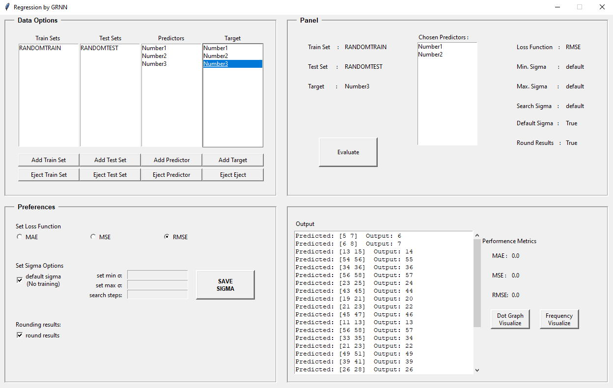

<h1>GRNN</h1>

A simple program that predicts continuous values output by using a technique call General Regression Neural Networks
 

<h3>What is GRNN?</h3>

Basically a neural network-based function estimation algorithm. GRNN can be used for regression, prediction and classification,
also it can be a good solution for online dynamical systems.

<h3>How does it work?</h3>

First, we train the network with a training dataset. Then, we feed it with a testing dataset.
Output is estimated using weighted average of the outputs of training dataset, where the weight is calculated using the euclidean distance between two datasets.
If the distance is large, it will put less weight to the output. If the distance is small, then vice versa.

<h3>Network Architecture</h3>

There are 4 types of layers in this model:

<li><b>Input Layer:</b> feeds the input to the next layer.</li>
<li><b>Pattern Layer:</b> calculates the euclidean distance and then activation function.</li>
<li><b>Summation Layer:</b> has 2 subparts; Numerator and Denominator.</li>
<li><b>Output Layer:</b> contains only 1 neuron which gives the output by dividing Numerator to Denominator.</li>
 

<h3>An overlook to the program</h3>

